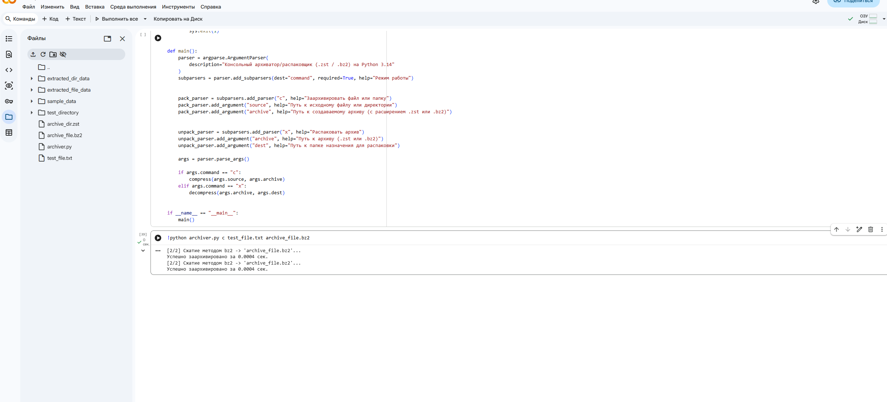
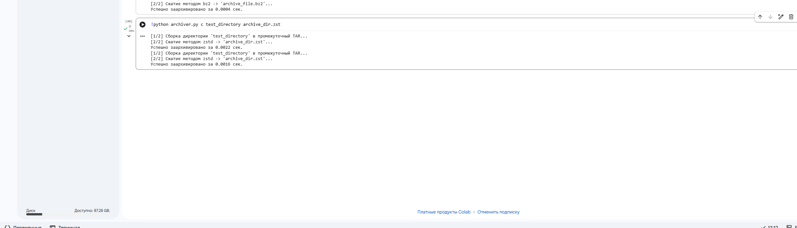
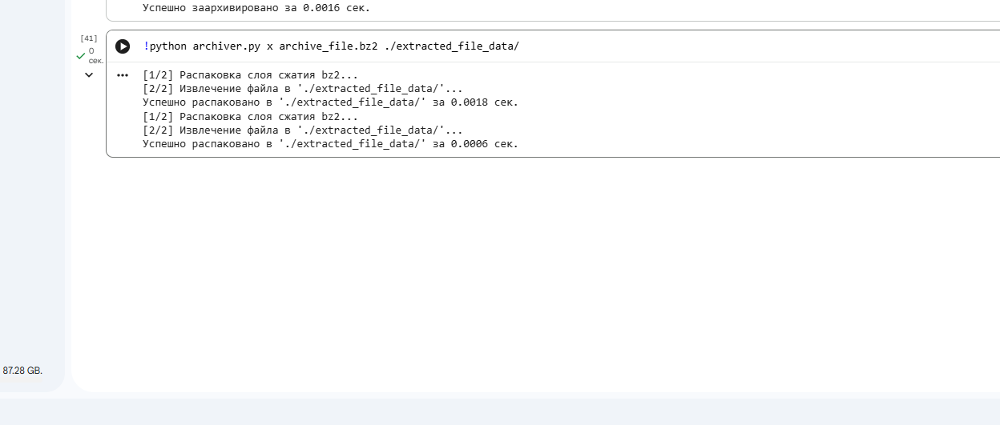
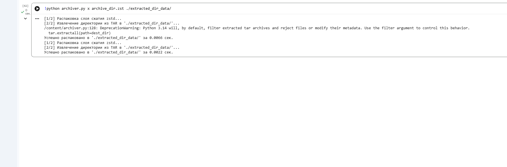

# Python 3.14 CLI Archiver / Decompressor

Консольная утилита для архивации и распаковки файлов и папок. Написана на базе Python 3.14 с использованием исключительно модулей стандартной библиотеки (`compression.zstd`, `compression.bz2`, `tarfile`, `argparse`).

## Особенности
*   Автоматический выбор алгоритма на основе расширения результирующего архива (`.zst` или `.bz2`).
*   Автоматическое оборачивание директорий в контейнер `tar` перед выполнением сжатия.
*   Потоковая обработка файлов чанками для оптимизации потребления RAM.

## Требования
*   Интерпретатор Python версии 3.14 или выше.

## Инструкция по запуску и ключи

Вызов справки:
```bash
python archiver.py --help
```

### 1. Архивация (Команда `c`)
Синтаксис: `python archiver.py c <что_архивируем> <имя_архива.zst|.bz2>`

*   **Пример архивации файла с помощью bz2:**
    ```bash
    python archiver.py c my_document.txt archive.bz2
    ```
*   **Пример архивации папки с помощью zstd:**
    ```bash
    python archiver.py c project_folder archive.zst
    ```

### 2. Распаковка (Команда `x`)
Синтаксис: `python archiver.py x <имя_архива.zst|.bz2> <куда_распаковать>`

*   **Пример распаковки bz2 архива:**
    ```bash
    python archiver.py x archive.bz2 ./extracted_data
    ```
*   **Пример распаковки zstd архива:**
    ```bash
    python archiver.py x archive.zst ./extracted_data
    ```
## Демонстрация работы (Скриншоты)

### 1. Архивация файла в формат .bz2


### 2. Архивация директории в формат .zst


### 3. Распаковка файла из архива .bz2


### 4. Распаковка директории из архива .zst

